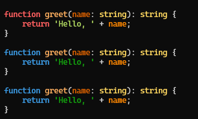
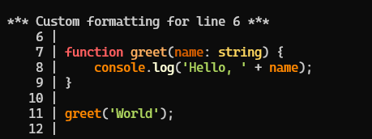
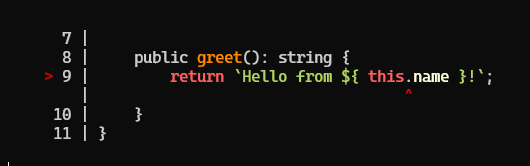

# xMap

[](https://remotex-labs.github.io/xMap/)
[](https://www.npmjs.com/package/@remotex-labs/xmap)
[](https://www.npmjs.com/package/@remotex-labs/xmap)
[](https://opensource.org/licenses/MPL-2.0)
[](https://github.com/remotex-labs/xMap/actions/workflows/ci.yml)
[](https://discord.gg/psV9grS9th)
[](https://deepwiki.com/remotex-labs/xMap)

`@remotex-labs/xmap` is a TypeScript library for source maps, stack traces, and terminal code output. It parses
Source Map v3 payloads, maps generated positions back to the original sources, normalizes error stacks from V8,
SpiderMonkey, and JavaScriptCore, and renders the surrounding code with syntax highlighting and error indicators.

## Key Features

- **Source map processing**: parse Source Map v3 payloads and query them by generated or original position.
- **Bias-aware lookups**: choose how inexact positions resolve with `Bias.BOUND`, `LOWER_BOUND`, and `UPPER_BOUND`.
- **Map merging**: concatenate several maps into one service with `SourceService.assign`, keeping indices correct.
- **Stack trace parsing**: turn a V8, SpiderMonkey, or JavaScriptCore stack into structured frames.
- **Error resolution**: map a parsed stack back to original sources with `resolveError` and `stackEntry`.
- **Code formatting**: render snippets with line numbers, custom padding, and per-line callbacks.
- **Syntax highlighting**: semantic TypeScript highlighting with a customizable color scheme.
- **Tree-shakeable**: side-effect-free ESM with subpath exports, so you ship only the components you import.

## Installation

Install `@remotex-labs/xmap` using npm:

```bash
npm install @remotex-labs/xmap
```

Or using Yarn:

```bash
yarn add @remotex-labs/xmap
```

The package requires Node.js 20 or later, and works in the browser through a bundler.

## Usage

Import from the root entry point, or from a subpath to pull in a single component:

```ts
import { SourceService, Bias } from '@remotex-labs/xmap';
import { parseErrorStack } from '@remotex-labs/xmap/parser.component';
import { formatCode, formatErrorCode } from '@remotex-labs/xmap/formatter.component';
import { highlightCode } from '@remotex-labs/xmap/highlighter.component';
```

The subpath exports are the smallest units the package offers; use them when you only need the parser, the
formatter, or the highlighter and want the rest tree-shaken away.

## Key Components

### SourceService

Load a source map, then query it for original positions, positions with the original content, or positions with a
window of surrounding code.

```ts
import { SourceService, Bias } from '@remotex-labs/xmap';

// Create from a JSON string or a parsed source map object
const sourceService = new SourceService(sourceMapJSON, 'bundle.js');

// Original position for a generated line and column
const originalPosition = sourceService.getPosition(12, 34);

// Original position for a known source file
const byOriginal = sourceService.getPositionByOriginal(3, 7, 'index.ts');

// Position with a window of surrounding code
const positionWithCode = sourceService.getPositionWithCode(12, 34, Bias.LOWER_BOUND, {
    linesAfter: 2,
    linesBefore: 2
});
```

Merge several maps into a single service with the static `assign` helper:

```ts
const merged = SourceService.assign(sourceA, sourceB);
```

#### Bias

When no segment matches the requested column exactly, `Bias` decides which neighbour wins:

- `Bias.BOUND` - closest match, with no directional preference
- `Bias.LOWER_BOUND` - prefers segments with a column less than or equal to the target
- `Bias.UPPER_BOUND` - prefers segments with a column greater than or equal to the target

```ts
const exactPosition = sourceService.getPosition(10, 15, Bias.BOUND);
const beforePosition = sourceService.getPosition(10, 15, Bias.LOWER_BOUND);
const afterPosition = sourceService.getPosition(10, 15, Bias.UPPER_BOUND);
```

### Stack Trace Parser

Parse an error stack from any supported engine into a normalized structure.

```ts
import { parseErrorStack } from '@remotex-labs/xmap/parser.component';

try {
    throw new Error('Example error');
} catch (error) {
    const parsedStack = parseErrorStack(<Error> error);

    console.log(parsedStack.name);     // "Error"
    console.log(parsedStack.message);  // "Example error"

    const frame = parsedStack.stack[0];
    console.log(frame.fileName);       // File where the error occurred
    console.log(frame.line);           // Line number
    console.log(frame.functionName);   // Function name
}
```

### Code Highlighter

Apply semantic TypeScript highlighting, with the default scheme or one of your own.

```ts
import { highlightCode } from '@remotex-labs/xmap/highlighter.component';

const code = `
function sum(a: number, b: number): number {
  return a + b;
}
`;

// Default color scheme
const highlightedCode = highlightCode(code);

// Or override individual colors
const customHighlightedCode = highlightCode(code, {
    numberColor: (text: string): string => `\x1b[31m${ text }\x1b[0m`,
    stringColor: (text: string): string => `\x1b[32m${ text }\x1b[0m`,
    keywordColor: (text: string): string => `\x1b[36m${ text }\x1b[0m`
});

console.log(customHighlightedCode);
```



### Code Formatter

`formatCode` adds line numbers with configurable padding, and can run a callback on a chosen line - useful for
documentation snippets and debug output.

```ts
import { formatCode } from '@remotex-labs/xmap/formatter.component';
import { highlightCode } from '@remotex-labs/xmap/highlighter.component';

const code = `
function greet(name: string) {
  console.log('Hello, ' + name);
}

greet('World');
`;

const formattedCode = formatCode(highlightCode(code), {
    action: {
        callback: (lineString, padding, lineNumber) => `*** Line ${ lineNumber } ***\n${ lineString }`,
        triggerLine: 3
    },
    padding: 8,
    startLine: 1
});

console.log(formattedCode);
```



`formatErrorCode` takes a resolved position and marks the offending column.

```ts
import { formatErrorCode } from '@remotex-labs/xmap/formatter.component';

const sourcePosition = {
    code: 'function divide(a, b) {\n  return a / b;\n}',
    line: 2,
    name: null,
    column: 13,
    source: '',
    endLine: 0,
    startLine: 1,
    sourceRoot: null,
    sourceIndex: 0,
    generatedLine: 0,
    generatedColumn: 0
};

const formattedError = formatErrorCode(sourcePosition, {
    color: (text) => `\x1b[31m${ text }\x1b[0m`  // Red error indicator
});

console.log(formattedError);
```



## Practical Examples

### Resolving a thrown error back to its source

```ts
import { SourceService, Bias } from '@remotex-labs/xmap';
import { parseErrorStack } from '@remotex-labs/xmap/parser.component';
import { formatErrorCode } from '@remotex-labs/xmap/formatter.component';
import { highlightCode } from '@remotex-labs/xmap/highlighter.component';

try {
    throw new Error('Something went wrong');
} catch (error) {
    const parsedStack = parseErrorStack(<Error> error);
    const frame = parsedStack.stack[0];

    if (frame.fileName && frame.line && frame.column) {
        const sourceService = new SourceService(sourceMapJSON);
        const position = sourceService.getPositionWithCode(
            frame.line,
            frame.column,
            Bias.LOWER_BOUND,
            { linesBefore: 2, linesAfter: 2 }
        );

        if (position) {
            position.code = highlightCode(position.code);
            console.log('Error occurred:');
            console.log(formatErrorCode(position, {
                color: (text) => `\x1b[31m${ text }\x1b[0m`
            }));
        }
    }
}
```

### Querying a source map directly

```ts
import { SourceService } from '@remotex-labs/xmap';

const sourceMapJSON = `
{
  "version": 3,
  "sources": ["../src/core/core.component.ts", "../src/index.ts"],
  "sourceRoot": "https://github.com/remotex-labs/xMap/tree/test/",
  "sourcesContent": [
    "export class CoreModule {\\r\\n  private name: string;\\r\\n}",
    "import { CoreModule } from '@core/core.component';\\r\\nconsole.log(new CoreModule('Core Module'));"
  ],
  "mappings":
    "aAAO,IAAMA,EAAN,KAAiB,CACZ,KAER,YAAYC,EAAc,CACtB,KAAK,KAAOA,CAChB,CAEO,OAAgB,CACnB,MAAO,cAAc,KAAK,IAAI,GAClC,CACJ,ECRA,IAAMC,EAAe,IAAIC,EAAW,aAAa,EAEjD,QAAQ,IAAID,EAAa,MAAM,CAAC",
  "names": ["CoreModule", "name", "coreInstance", "CoreModule"]
}
`;

const sourceService = new SourceService(sourceMapJSON, 'bundle.js');
console.log(sourceService.getPositionByOriginal(3, 7, 'index.ts'));
console.log(sourceService.getPositionWithCode(1, 104, 1, { linesBefore: 2, linesAfter: 2 }));
```

## Documentation

Full guides and the complete API reference live at
**[remotex-labs.github.io/xMap](https://remotex-labs.github.io/xMap/)**.

## Contributing

Contributions are welcome!\
Please see our [Contributing Guide](CONTRIBUTING.md) for details.

## Links

- [Documentation](https://remotex-labs.github.io/xMap/)
- [GitHub Repository](https://github.com/remotex-labs/xMap)
- [Issue Tracker](https://github.com/remotex-labs/xMap/issues)
- [npm Package](https://www.npmjs.com/package/@remotex-labs/xmap)

## License

This project is licensed under the Mozilla Public License 2.0 - see the [LICENSE](LICENSE) file for details.
